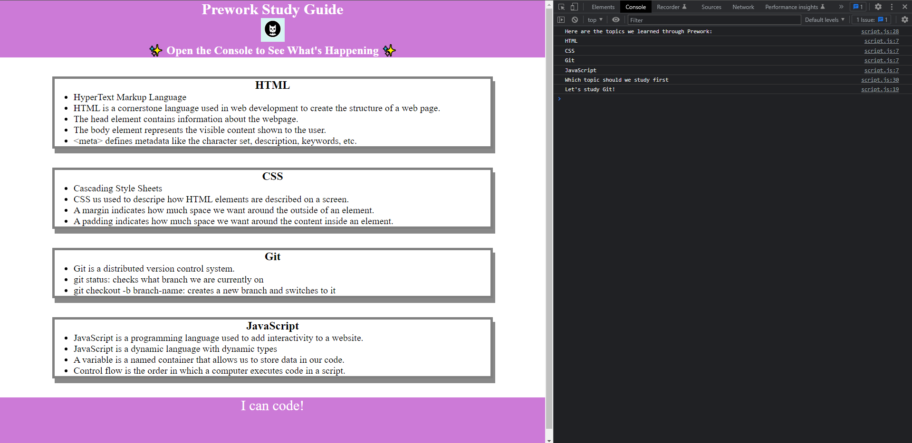

# Prework Study Guide Webpage

## Description

This Prework Study Guide was created for the Georgia Tech Full Stack Development Course and contains notes on HTML, CSS, git, and JavaScript learned during the Prework section of the course.

## Installation

N/A

## Usage

This study guide can be used to review the notes taken during the Prework section of the GATECH Full Stack Development Course. There are sections pertaining to HTML, CSS, Git, and JavaScript. If you open the DevTools console you can see the JavaScript running. You can do this by pressing Command+Option+I (macOS) or Control+Shift+I (Windows). In this new window you will see the list of topics learned along with a suggestion on what to study first.

## Credits

N/A

## License

Please refer to the LICENSE in the repo.
